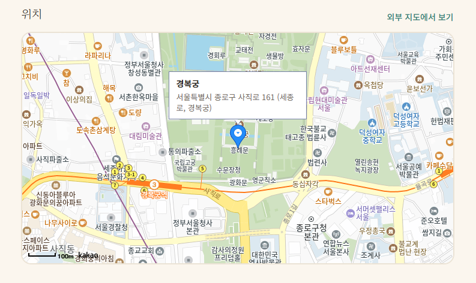
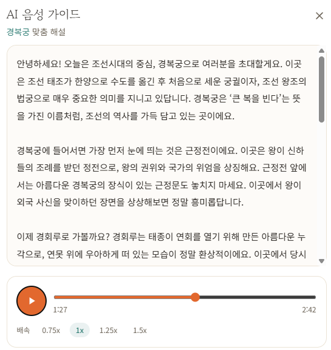
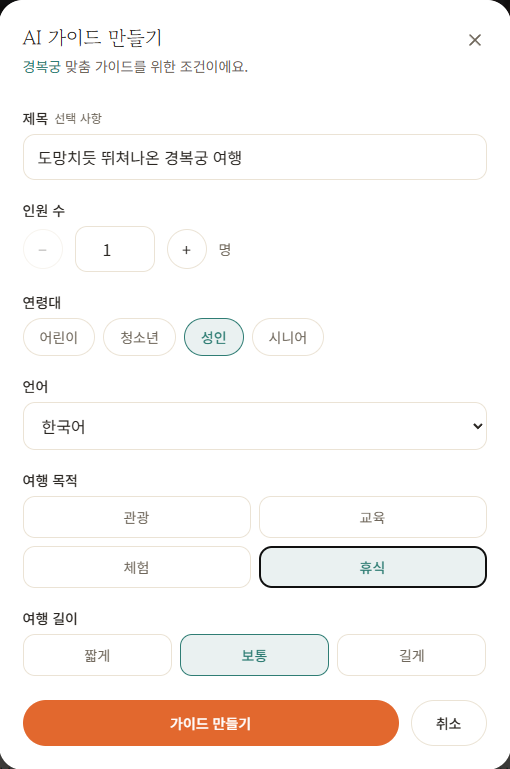
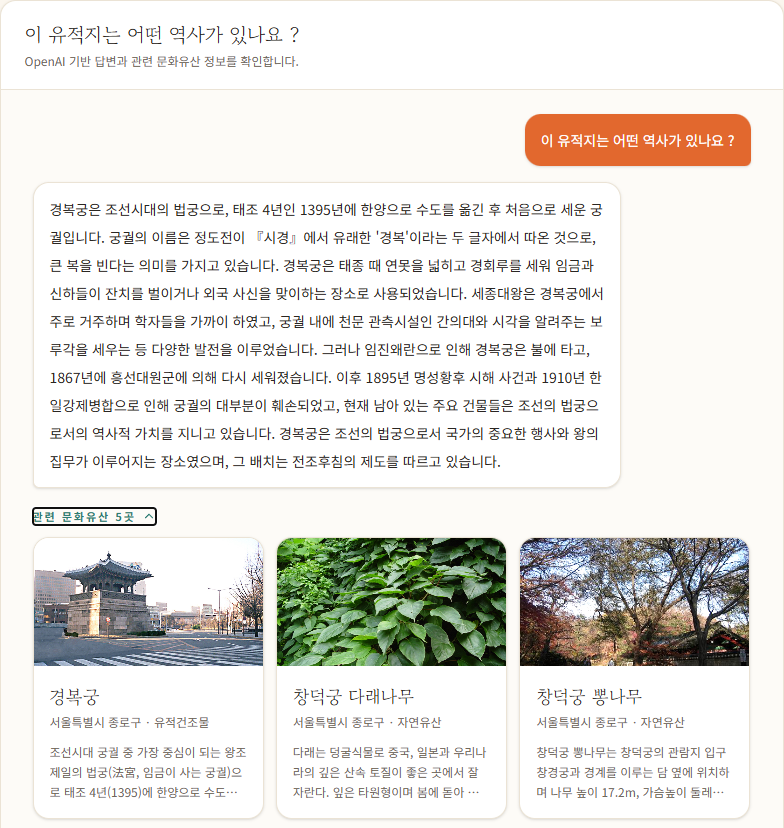

# 🏛️ Heritgo

### 오늘, 가장 가까운 천 년 — 들으면서 떠나는 국가 유산 가이드


> 사진 한 장에 끌려 경복궁 앞에 섰지만, 안내판은 한자투성이고 검색하면 블로그마다 말이 다릅니다.
> **Heritgo** 는 공식 국가유산 데이터를 근거로, 지금 내 앞의 유산을 *내 눈높이로* 들려주는 답사 동반자입니다.

<p align="center">
</p>

<br>

## 무엇을 할 수 있나요

- **검색 & 지도** — 국가유산을 검색하고 카카오맵에서 위치를 바로 확인
- **맥락 인지 AI 챗봇** — 지금 보고 있는 유산과 내 위치를 알고, 공식 데이터를 근거로 답변
- **AI 오디오 가이드** — 안내판 대신 이어폰으로, 걸으면서 듣는 해설
- **개인화 추천** — 내 취향·위치·이력에 맞는 유산을 골라서 추천

<br>

## 둘러보기

<table>
  <tr>
    <td width="50%"><p align="center"><b>검색 &amp; 지도</b></p></td>
    <td width="50%"><p align="center"><b>맥락 인지 AI 챗봇</b></p></td>
  </tr>
  <tr>
    <td width="50%"><p align="center"><b>AI 오디오 가이드</b></p></td>
    <td width="50%"><p align="center"><b>유산 상세 &amp; 추천</b></p></td>
  </tr>
</table>

<br>

## 실행

```bash
npm install
echo "VITE_KAKAO_MAP_KEY=발급받은_키" > .env   # 지도 표시에 필요
npm run dev          # http://localhost:5173
```

기본적으로 배포된 백엔드(Railway)에 연결됩니다. 로컬 백엔드로 개발하려면 `.env.local` 에 `VITE_API_BASE_URL=http://127.0.0.1:8000` 을 추가하세요. (dev 서버가 `/api` 를 `:8000` 으로 프록시합니다.)

<br>

## 기술 스택

**Vue 3** · **Vite** · **Vue Router** · **Tailwind CSS v4** · **Axios** · **Kakao Maps**

<br>

## 화면 구성

| 경로 | 화면 |
|------|------|
| `/` | 유산 목록 + 추천 |
| `/heritages/:id` | 유산 상세 |
| `/chatbot` | 맥락 인지 AI 챗봇 |
| `/guides` · `/guides/:id` | AI 오디오 가이드 |
| `/profiles` | 가이드 프로필 |
| `/login` · `/signup` | 인증 |

<br>

## 구조

```
src/
  api/          백엔드 통신 (auth · heritage · chatbot · guide · recommendation · profile)
  views/        라우트 화면
  components/   KakaoMap · GuideAudioPlayer · HeritageCard · *Modal
  composables/  useAudioPlayer (미니플레이어·백그라운드 재생)
  utils/        chatbotContext(맥락 주입) · loadKakaoMap
```

<br>

## 배포

Vercel 정적 빌드. `VITE_` 환경변수는 빌드 시 주입됩니다.
